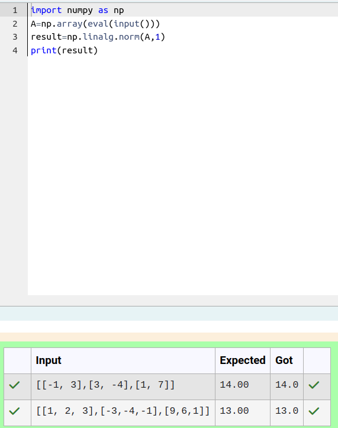
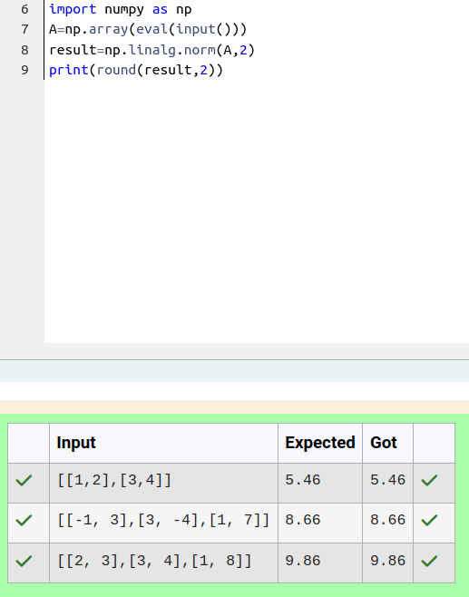
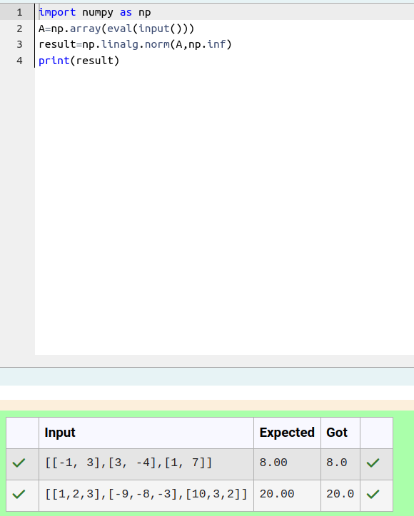

# Norm of a matrix
## Aim
To write a program to find the 1-norm, 2-norm and infinity norm of the matrix and display the result in two decimal places.
## Equipment’s required:
1.	Hardware – PCs
2.	Anaconda – Python 3.7 Installation / Moodle-Code Runner
## Algorithm:
### PROGRAM -1
1.Get the input matrix using np.array()   

2.Find the 2-norm of the matrix using np.linalg.norm()

3.Print the norm of the matrix in two decimal places.

### PROGRAM-2
1.Get the input matrix using np.array()

2.Find the 2-norm of the matrix using np.linalg.norm()

3.Print the norm of the matrix in two decimal places.
### PROGRAM -3

1.Get the input matrix using np.array()

2.Find the infinity-norm of the matrix using np.linalg.norm()

3.Print the round off value for the norm of the matrix.
## Program:
```Python
# Register No:24901022
# Developed By: KATHIRESH M

# 1-Norm of a Matrix
import numpy as np
a=np.array(eval(input()))
result=np.linalg.norm(a,1)
print(result)


# 2-Norm of a Matrix
import numpty as mp
a mp array (eval(input()))
result np.finally norm(2.2)
(print(round(result.239))


# Infinity Norm of a Matrix
import numpy as np
A-np.array(eval(input()))
result=np.linalg.norm(A,np.inf)
print(result)

```


## Output:
### 1-Norm of a Matrix

<br>
<br>

### 2-Norm of a Matrix

<br>
<br>

### Infinity Norm of a Matrix

<br>
<br>

## Result
Thus the program for 1-norm, 2-norm and Infinity norm of a matrix are written and verified.
